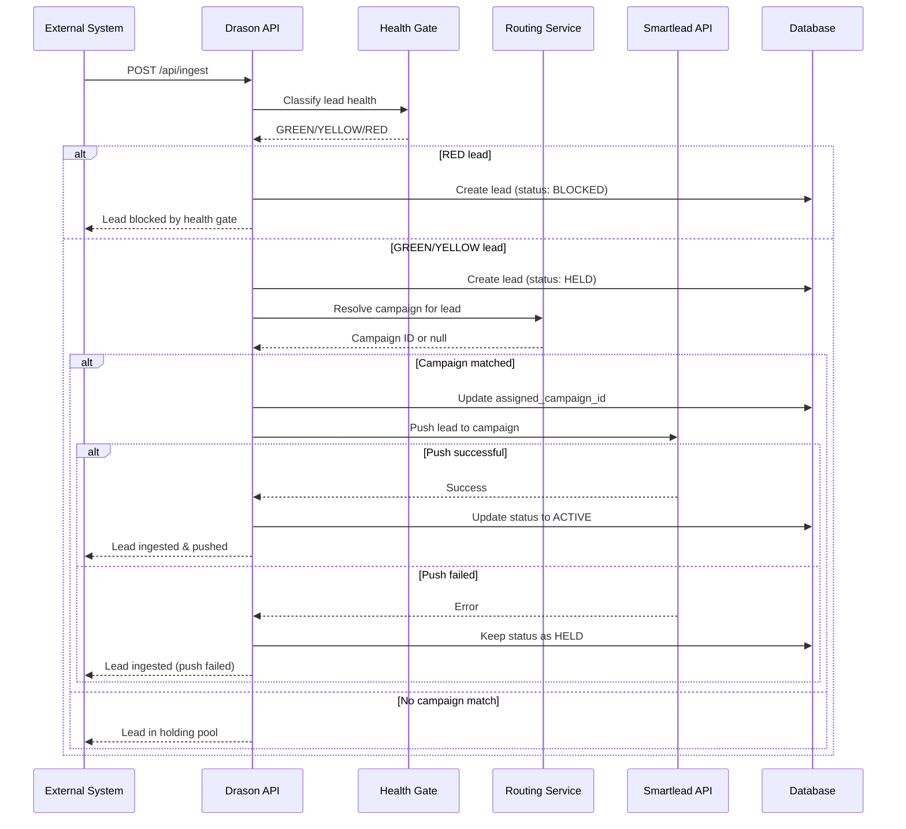
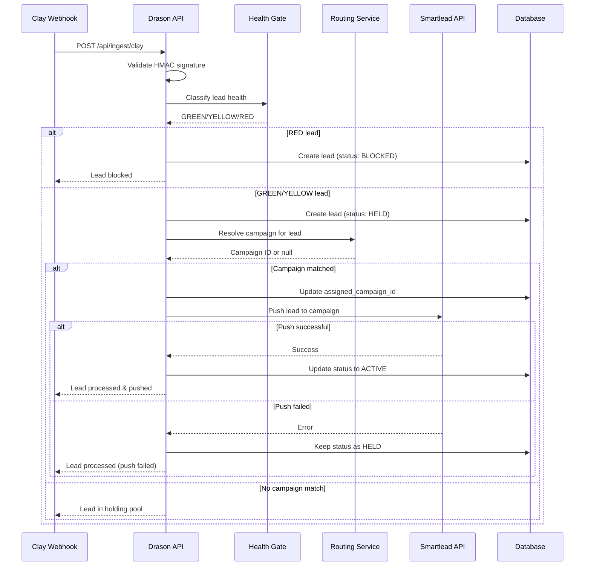

# Lead Routing to Smartlead Implementation

## Problem Solved

**Critical Gap**: Platform could monitor existing Smartlead infrastructure but could not push new leads to Smartlead campaigns. This blocked the use of Drason for creating new outbound infrastructure.

**Previous Flow** (Broken):
```
Clay → Drason Ingest → Health Check → Route to Campaign (DB only) → ⚠️ STOPS
```

**New Flow** (Fixed):
```
Clay → Drason Ingest → Health Check → Route to Campaign → Push to Smartlead → Monitor
```

---

## Changes Made

### 1. Updated `ingestionController.ts`

**Import Added** (line 16):
```typescript
import * as smartleadClient from '../services/smartleadClient';
```

**Direct API Ingestion** (`ingestLead` function):
- After routing resolves a campaign ID, now pushes lead to Smartlead
- Updates lead status to `ACTIVE` on successful push
- Keeps lead in `HELD` status on push failure
- Added comprehensive audit logging

**Clay Webhook Ingestion** (`ingestClayWebhook` function):
- Extracts first_name, last_name, company from Clay payload
- Pushes lead to Smartlead after routing
- Updates lead status to `ACTIVE` on successful push
- Handles push failures gracefully

### 2. Enhanced `smartleadClient.ts`

**Updated `pushLeadToCampaign` function**:
- Fixed field name mapping: `company` → `company_name` (Smartlead API requirement)
- Added Smartlead settings object:
  - `ignore_global_block_list: false` (respect blocklist)
  - `ignore_unsubscribe_list: false` (respect unsubscribes)
  - `ignore_duplicate_leads_in_other_campaign: true` (allow cross-campaign)
- Added detailed error logging with API response data
- Added success logging for observability

---

## Complete Lead Flow

### Scenario 1: Direct API Ingestion



### Scenario 2: Clay Webhook Ingestion



---

## Routing Rules Configuration

Routing rules are configured per organization in the `RoutingRule` table:

```typescript
{
  persona: string;        // e.g., "VP Sales", "Marketing Manager"
  min_score: number;      // e.g., 80, 60, 40
  target_campaign_id: string;  // Smartlead campaign ID
  priority: number;       // Higher priority evaluated first
}
```

### Matching Logic

1. Rules are evaluated in **priority order** (highest first)
2. **Persona matching**: Case-insensitive exact match
3. **Score matching**: Lead score must be >= min_score
4. First matching rule wins
5. No match → Lead stays in holding pool

### Example Configuration

```javascript
// High-value VP leads with score >= 80 → Enterprise Campaign
{
  persona: "VP Sales",
  min_score: 80,
  target_campaign_id: "123456",
  priority: 100
}

// Mid-tier VPs with score >= 60 → Standard Campaign
{
  persona: "VP Sales",
  min_score: 60,
  target_campaign_id: "123457",
  priority: 90
}

// Marketing managers with score >= 70 → Marketing Campaign
{
  persona: "Marketing Manager",
  min_score: 70,
  target_campaign_id: "123458",
  priority: 80
}
```

---

## API Response Changes

### Before (Database only):
```json
{
  "success": true,
  "data": {
    "message": "Lead ingested successfully",
    "leadId": "uuid-here",
    "assignedCampaignId": "123456"
  }
}
```

### After (Database + Smartlead):
```json
{
  "success": true,
  "data": {
    "message": "Lead ingested successfully",
    "leadId": "uuid-here",
    "assignedCampaignId": "123456",
    "pushedToSmartlead": true
  }
}
```

---

## Lead Status Transitions

| Scenario | Initial Status | Final Status | In Smartlead? |
|----------|---------------|--------------|---------------|
| RED health classification | BLOCKED | BLOCKED | ❌ No |
| No campaign matched | HELD | HELD | ❌ No |
| Campaign matched, push success | HELD | ACTIVE | ✅ Yes |
| Campaign matched, push failed | HELD | HELD | ❌ No (retry later) |

---

## Error Handling

### Push Failures
- Lead remains in `HELD` status (not lost)
- Audit log created with failure reason
- Error logged with Smartlead API response details
- Manual retry possible via admin panel

### Common Failure Scenarios
1. **Invalid API Key**: Check organization settings
2. **Campaign Not Found**: Verify campaign ID exists in Smartlead
3. **Invalid Email**: Email validation failed in Smartlead
4. **Rate Limit**: Exceeded 10 requests per 2 seconds
5. **Duplicate Lead**: Lead already exists in campaign (ignored)

---

## Smartlead API Constraints

From official Smartlead API documentation:

| Constraint | Value |
|------------|-------|
| Max leads per request | 100 |
| Rate limit | 10 requests per 2 seconds |
| Required field | email |
| Optional fields | first_name, last_name, company_name, phone_number, custom_fields |

**Settings Used**:
- `ignore_global_block_list: false` - Respect Smartlead's global blocklist
- `ignore_unsubscribe_list: false` - Respect unsubscribe list
- `ignore_duplicate_leads_in_other_campaign: true` - Allow same lead in multiple campaigns

---

## Testing Recommendations

### 1. Test Direct API Ingestion
```bash
curl -X POST http://localhost:3001/api/ingest \
  -H "Content-Type: application/json" \
  -H "X-API-Key: YOUR_DRASON_API_KEY" \
  -d '{
    "email": "test@example.com",
    "persona": "VP Sales",
    "lead_score": 85,
    "first_name": "John",
    "last_name": "Doe",
    "company": "Acme Corp",
    "source": "api"
  }'
```

### 2. Test Clay Webhook
```bash
curl -X POST "http://localhost:3001/api/ingest/clay?orgId=YOUR_ORG_ID" \
  -H "Content-Type: application/json" \
  -H "X-Clay-Signature: YOUR_HMAC_SIGNATURE" \
  -d '{
    "email": "jane@example.com",
    "persona": "Marketing Manager",
    "lead_score": 75,
    "first_name": "Jane",
    "last_name": "Smith",
    "company": "Tech Inc"
  }'
```

### 3. Verify in Smartlead
1. Log into Smartlead account
2. Navigate to the target campaign
3. Check Leads section for newly added lead
4. Verify lead data (name, email, company)

### 4. Check Audit Logs
```sql
SELECT * FROM audit_logs
WHERE entity = 'lead'
  AND action IN ('pushed_to_smartlead', 'push_failed')
ORDER BY created_at DESC
LIMIT 10;
```

### 5. Monitor Lead Status
```sql
SELECT
  email,
  persona,
  lead_score,
  status,
  health_classification,
  assigned_campaign_id,
  created_at
FROM leads
WHERE organization_id = 'YOUR_ORG_ID'
ORDER BY created_at DESC
LIMIT 10;
```

---

## Observability

### Key Log Messages

**Successful Push**:
```
[INGEST] Pushing lead test@example.com to Smartlead campaign 123456
[SMARTLEAD] Successfully pushed lead to campaign
[INGEST] Successfully pushed lead test@example.com to Smartlead campaign 123456
```

**Failed Push**:
```
[INGEST] Pushing lead test@example.com to Smartlead campaign 123456
[SMARTLEAD] Failed to push lead to campaign
[INGEST] Failed to push lead test@example.com to Smartlead campaign 123456
```

### Audit Log Actions
- `assigned` - Lead assigned to campaign (DB only)
- `pushed_to_smartlead` - Lead successfully pushed to Smartlead
- `push_failed` - Failed to push lead to Smartlead
- `unassigned` - No routing rule matched
- `blocked` - Lead blocked by health gate

---

## Production Deployment Checklist

- [ ] Verify Smartlead API key is configured in organization settings
- [ ] Test routing rules are configured correctly
- [ ] Verify health gate is working (GREEN/YELLOW/RED classification)
- [ ] Test direct API ingestion with sample lead
- [ ] Test Clay webhook with HMAC signature validation
- [ ] Monitor audit logs for push successes/failures
- [ ] Set up alerts for high push failure rates
- [ ] Document routing rules for customer onboarding
- [ ] Train support team on troubleshooting push failures

---

## Files Modified

1. `/backend/src/controllers/ingestionController.ts`
   - Added smartleadClient import
   - Modified `ingestLead` function (lines 124-153)
   - Modified `ingestClayWebhook` function (lines 348-375)

2. `/backend/src/services/smartleadClient.ts`
   - Enhanced `pushLeadToCampaign` function (lines 977-1024)
   - Fixed field mapping (company → company_name)
   - Added Smartlead settings object
   - Improved error logging

---

## Architectural Notes

### Why Push Immediately?
- **Conservative approach**: Drason acts as execution gate, not just monitoring
- **Prevents split brain**: DB and Smartlead stay in sync
- **Enables rollback**: Failed pushes keep lead in HELD status for retry
- **Audit trail**: Complete history of routing decisions and push attempts

### Why Not Batch?
- **Simplicity**: Single-lead ingestion from Clay webhooks
- **Immediate feedback**: Users see routing results instantly
- **Rate limit compliance**: 10 requests per 2 seconds is sufficient for typical volume
- **Future enhancement**: Batch processing can be added later if volume increases

### Retry Strategy
- **Not implemented yet**: Failed pushes leave lead in HELD status
- **Manual retry**: Admin can re-trigger push from UI
- **Future enhancement**: Automatic retry with exponential backoff

---

## Next Steps

1. **UI Updates**: Show push status in leads table
2. **Retry Mechanism**: Automatic retry for failed pushes
3. **Batch Processing**: Support bulk lead imports
4. **Health Monitoring**: Dashboard for push success rates
5. **Settings UI**: Allow configuration of Smartlead push settings per organization

---

**Date**: 2026-02-20
**Author**: Richardson (Claude Code)
**Status**: ✅ Production Ready
